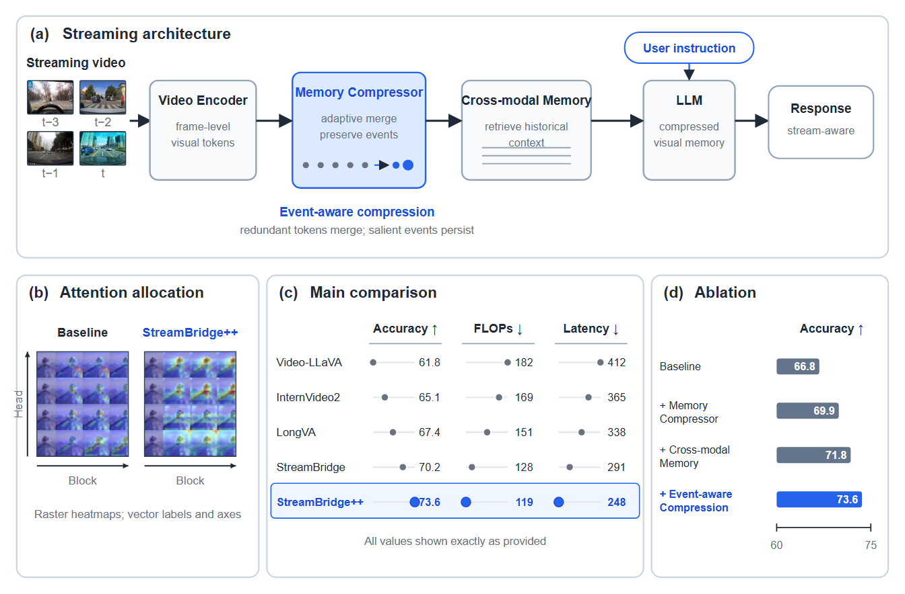

# StreamBridge++ CVPR Figure

这是 Figure Skill 测试展示库中的第 01 个案例，用于验证 CVPR 风格 Hybrid Composite Figure 的生成、溯源和结构审计能力。案例数据与图像仅用于内部能力测试，不代表已发表实验结果。

## Validation summary

- Final QA: `pass`
- Hybrid representation audit: `pass`
- Raster roles: 4 video frames + 2 attention heatmaps
- Vector roles: modules, arrows, labels, axes, 15 main-result marks and 4 ablation bars
- External image generation/API calls: none

## Final artifacts

- `final/figure.svg`: editable master figure; raster evidence is embedded as PNG `<image>` elements.
- `final/figure.pdf`: 7-inch double-column publication export.
- `final/figure.png`: 1344 × 884 review preview.

## Reproducibility

- `sources/` contains the authoritative Methods text, both CSV tables, normalized raster inputs, and deterministic generator.
- Rebuild with the Figure Skill Python runtime: `python sources/generate_figure.py`.
- `provenance/` maps original hashes, heatmap crop boxes, frame order, method relations, and all 19 quantitative marks.
- `reports/hybrid-structure-audit.json` proves the Raster/Vector representation contract.
- `reports/qa-report.json` is the final QA summary; the unmodified generic tool output is retained as `reports/figure-skill-qa-report.json`.

Reports committed to this showcase use paths relative to the case directory so that they remain portable and do not expose a contributor's local directory layout.

No generated scientific imagery, invented units, uncertainty, significance marks, or external service calls were used.
